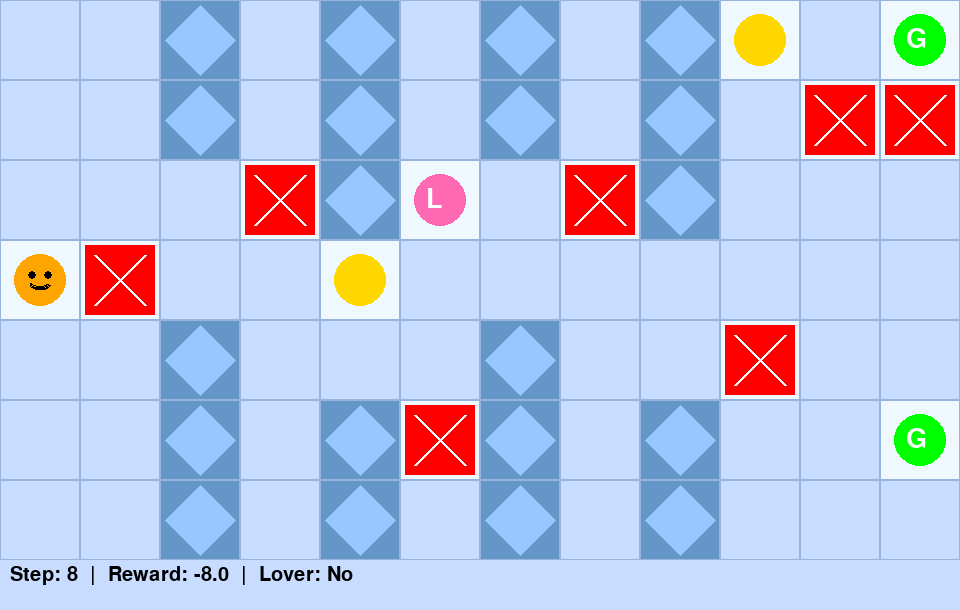
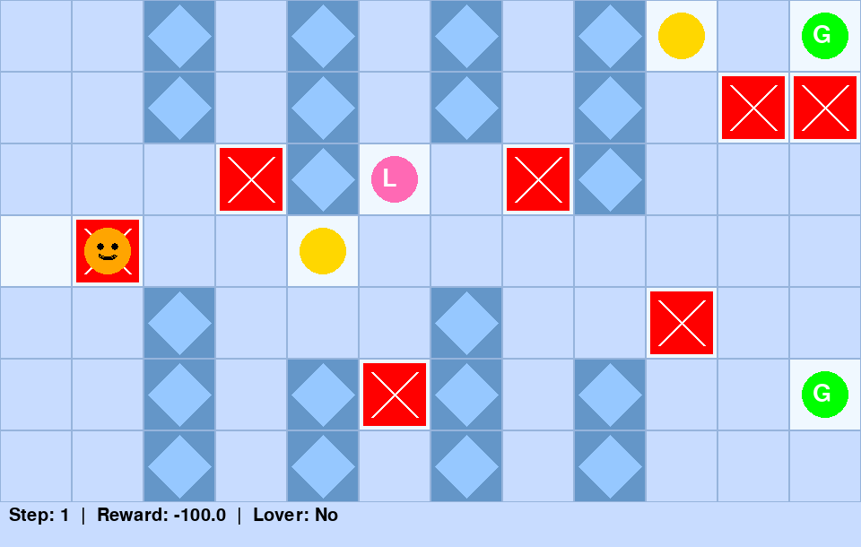
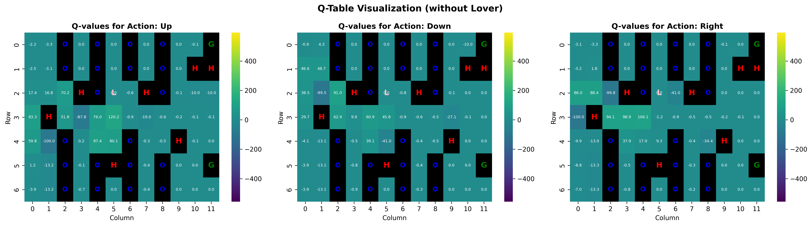
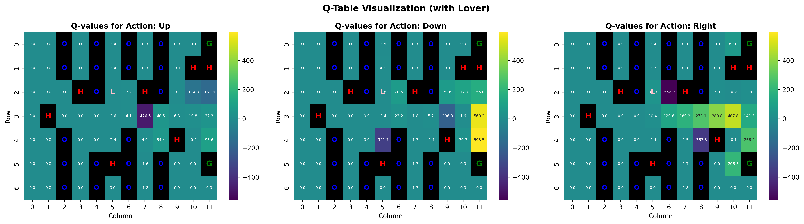
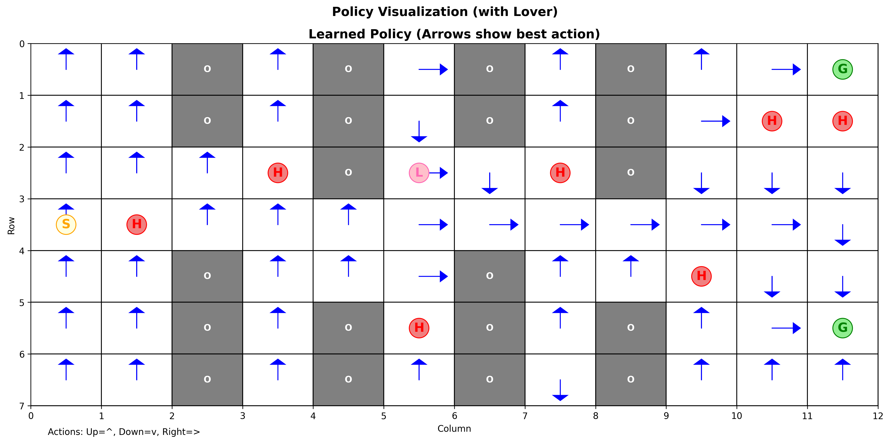

# PADM Q-Learning Agent: Reinforcement Learning Project

[](https://www.python.org/downloads/)
[](https://opensource.org/licenses/MIT)
[](https://gymnasium.farama.org/)

> **Planning and Decision Making (PADM) Course Project**  
> A complete implementation of a custom Grid World environment and Q-Learning agent with visualization tools.

---

## Table of Contents

- [Overview](#overview)
- [Features](#features)
- [Project Structure](#project-structure)
- [Installation](#installation)
- [Quick Start](#quick-start)
- [Assignment 1: Custom Environment](#assignment-1-custom-environment)
- [Assignment 2: Q-Learning Agent](#assignment-2-q-learning-agent)
- [Results](#results)
- [Visualizations](#visualizations)
- [Technical Details](#technical-details)
- [Contributing](#contributing)
- [License](#license)

---

## Overview

This repository contains two assignments from the PADM course:

1. **Assignment 1**: Custom Grid World Environment built with OpenAI Gymnasium
2. **Assignment 2**: Q-Learning Agent that learns to navigate the environment

The project features an Ice Age-themed maze where the agent (Scrat) must navigate through obstacles, avoid danger zones, collect rewards, and reach the goal. A special "Lover" mechanic adds strategic depth: visiting the lover multiplies the goal reward by 6x!

### Demo GIF


*Interactive demonstration of the environment with random agent*


*Trained Q-Learning agent navigating optimally to goal*

### Key Highlights

- **Fully Gymnasium-compatible** environment
- **Q-Learning** with epsilon-greedy exploration
- **Reverse sigmoid epsilon decay** for smooth exploration-exploitation balance
- **Comprehensive visualizations**: Q-tables, policies, training curves
- **Pygame-based rendering** for interactive visualization
- **100% success rate** after training

---

## Features

### Environment Features
- **7×12 Grid World** with 84 cells
- **20 Obstacles** (ice crystals) that block movement
- **7 Danger States** (hell zones) with large penalties
- **2 Goal States** for flexible navigation
- **2 Reward States** (mini rewards)
- **1 Lover State** that multiplies goal reward by 6x
- **3 Actions**: Up, Down, Right
- **State Space**: `[row, col, has_lover]` - includes lover status

### Agent Features
- **Q-Learning Algorithm** with Bellman equation updates
- **Epsilon-Greedy Exploration** with configurable decay
- **Reverse Sigmoid Decay** for smooth exploration-exploitation transition
- **4D Q-Table**: `(rows, cols, has_lover, actions)`
- **Training Statistics**: rewards, success rate, epsilon history
- **Visualization Tools**: heatmaps, policy arrows, training curves

---

## Project Structure

```
padm-qlearning-agent-rl/
├── README.md                    # This file
├── requirements.txt             # Python dependencies
├── assignment1/                # Custom Environment
│   ├── chid_env.py             # Main environment class
│   ├── demo.py                 # Demo script
│   ├── README.md               # Assignment 1 documentation
│   └── images/                 # Optional: Custom sprites
├── assignment2/                # Q-Learning Agent
│   ├── assignment1_meftun.py  # Environment (from Assignment 1)
│   ├── assignment2_qlearning.py # Q-Learning agent implementation
│   ├── assignment2_main.py     # Training script
│   ├── run_trained_agent.py    # Demo trained agent
│   ├── q_table_final_4d.npy   # Pre-trained Q-table
│   └── README.md               # Assignment 2 documentation
└── assets/                      # Visualizations and screenshots
    ├── images/                 # Static images
    ├── gifs/                   # Animated demonstrations
    └── screenshots/            # Environment screenshots
```

---

## Installation

### Prerequisites

- Python 3.8 or higher
- pip (Python package manager)

### Step 1: Clone the Repository

```bash
git clone https://github.com/mftnakrsu/padm-qlearning-agent-rl.git
cd padm-qlearning-agent-rl
```

### Step 2: Install Dependencies

```bash
pip install -r requirements.txt
```

Or install manually:

```bash
pip install gymnasium numpy matplotlib seaborn pygame imageio pillow
```

### Step 3: Verify Installation

```bash
cd assignment1
python demo.py
```

You should see a pygame window with the environment!

---

## Quick Start

### Run Assignment 1 (Environment Demo)

```bash
cd assignment1
python demo.py
```

**Expected Output:**
- Pygame window opens showing the 7×12 grid
- Agent starts at [3, 0]
- Use keyboard controls (W/S/D) to navigate
- Press Q to quit

### Run Assignment 2 (Train Q-Learning Agent)

```bash
cd assignment2
python assignment2_main.py
```

**Expected Output:**
```
Training Q-Learning Agent...
Episode 1/500: Reward: -150, Success: False
Episode 2/500: Reward: -200, Success: False
...
Episode 500/500: Reward: 686, Success: True

Training Complete!
Success Rate: 100.0%
Average Reward: 686.0
```

### Run Trained Agent Demo

```bash
cd assignment2
python run_trained_agent.py
```

Watch the trained agent navigate optimally:
1. Start at [3, 0]
2. Visit Lover at [2, 5] (+100 reward)
3. Reach Goal at [5, 11] (+600 reward)
4. **Total: 686 reward in 17 steps!**

---

## Assignment 1: Custom Environment

### Environment Description

The environment is a 7×12 grid world with the following layout:

```
. . O . O . O . O R . G    <- Row 0 (Goal at [0,11])
. . O . O . O . O . H H    <- Row 1 (Danger zones)
. . . H O L . H O . . .    <- Row 2 (Lover at [2,5])
A H . . R . . . . . . .    <- Row 3 (Agent starts at [3,0])
. . O . . . O . . H . .    <- Row 4
. . O . O H O . O . . G    <- Row 5 (Goal at [5,11])
. . O . O . O . O . . .    <- Row 6

Legend:
  A = Agent Start
  G = Goal
  H = Hell (Danger Zone)
  O = Obstacle (Ice Crystal)
  R = Reward
  L = Lover
  . = Empty Cell
```

### Screenshots


*Initial state of the environment - agent starts at position [3, 0]*


*Agent navigating through the maze with obstacles and danger zones*


*Agent successfully reaching the goal state*

### Observation Space

- **Type**: `Box(3,)` with dtype `int32`
- **Contents**: `[row, col, has_lover]`
  - `row`: 0 to 6 (agent's row position)
  - `col`: 0 to 11 (agent's column position)
  - `has_lover`: 0 or 1 (whether agent has visited lover)

### Action Space

- **Type**: `Discrete(3)`
- **Actions**:
  - `0`: Move Up
  - `1`: Move Down
  - `2`: Move Right

### Reward Structure

| Event | Reward |
|-------|--------|
| Step (living cost) | -1 |
| Goal reached | +100 |
| Goal with lover | +600 |
| Hit danger | -100 |
| Hit danger with lover | -600 |
| Find lover (first time) | +100 |
| Collect mini reward | +1 |

### Required Methods

All Gymnasium standard methods are implemented:

- `__init__()` - Initialize environment
- `reset()` - Reset to initial state
- `step(action)` - Execute action
- `render()` - Visualize state (pygame/text)
- `close()` - Cleanup resources

### Example Usage

```python
from chid_env import create_env

# Create environment
env = create_env(render_mode="pygame")

# Reset
obs, info = env.reset()
print(f"Initial state: {obs}")  # [3, 0, 0]

# Run episode
done = False
while not done:
    env.render()
    action = env.action_space.sample()  # Random action
    obs, reward, terminated, truncated, info = env.step(action)
    done = terminated or truncated
    print(f"Action: {action}, Reward: {reward}, Done: {done}")

env.close()
```

---

## Assignment 2: Q-Learning Agent

### Algorithm Overview

The Q-Learning algorithm learns the optimal action-value function Q(s, a) using the Bellman equation:

```
Q(s, a) ← Q(s, a) + α [r + γ max Q(s', a') - Q(s, a)]
```

Where:
- `α` (alpha) = learning rate
- `γ` (gamma) = discount factor
- `r` = immediate reward
- `s'` = next state

### Key Features

1. **Epsilon-Greedy Exploration**
   - Explores with probability `ε`
   - Exploits (greedy) with probability `1-ε`

2. **Reverse Sigmoid Epsilon Decay**
   ```python
   ε(t) = ε_min + (ε_initial - ε_min) / (1 + exp(k * (t - t0)))
   ```
   - Smooth transition from exploration to exploitation
   - Better than simple multiplicative decay

3. **4D Q-Table Structure**
   - Shape: `(7, 12, 2, 3)`
   - Dimensions: `(rows, cols, has_lover, actions)`
   - Enables different policies before/after visiting lover

### Hyperparameters

Default configuration (optimized):

```python
{
    'learning_rate': 0.1,        # α
    'discount_factor': 0.99,      # γ
    'epsilon': 1.0,               # Initial exploration
    'epsilon_min': 0.05,          # Minimum exploration
    'use_reverse_sigmoid': True,  # Use reverse sigmoid decay
    'sigmoid_k': 0.008,           # Decay rate
    'sigmoid_t0': 300             # Inflection point
}
```

### Training Process

```python
from chid_env import create_env
from assignment2_qlearning import QLearningAgent

# Create environment
env = create_env()

# Create agent
agent = QLearningAgent(
    env,
    learning_rate=0.1,
    discount_factor=0.99,
    epsilon=1.0,
    epsilon_min=0.05
)

# Train
training_stats = agent.train(
    num_episodes=500,
    verbose=True,
    save_frequency=50
)

# Save Q-table
agent.save_q_table("q_table_final_4d.npy")
```

### Training Output

```
Episode 1/500: Reward: -150, Success: False, Epsilon: 0.999
Episode 50/500: Reward: 200, Success: True, Epsilon: 0.850
Episode 100/500: Reward: 500, Success: True, Epsilon: 0.650
...
Episode 500/500: Reward: 686, Success: True, Epsilon: 0.050

Training Statistics:
  Total Episodes: 500
  Success Rate: 100.0%
  Average Reward: 686.0
  Average Steps: 17.0
```

---

## Results

### Training Performance

After 500 episodes of training:

| Metric | Value |
|--------|-------|
| **Success Rate** | 100% |
| **Average Reward** | 686 |
| **Average Steps** | 17 |
| **Optimal Path** | Start → Lover → Goal |

### Learned Policy

The agent learns the optimal strategy:

1. **Start** at [3, 0]
2. Navigate to **Lover** at [2, 5] (+100 reward)
3. Navigate to **Goal** at [5, 11] (+600 reward)
4. **Total**: 686 reward in 17 steps

### Comparison with Baseline

| Method | Success Rate | Avg Reward | Avg Steps |
|--------|--------------|------------|-----------|
| Random Agent | ~5% | -150 | 50+ |
| **Q-Learning** | **100%** | **686** | **17** |

---

## Visualizations

### 1. Q-Table Heatmaps

Visualization of learned Q-values for each action:


*Q-values before visiting lover - shows agent's strategy to reach lover first*


*Q-values after visiting lover - shows agent's strategy to reach goal*

### 2. Policy Visualization

Arrow-based policy visualization showing optimal actions:


*Optimal policy before visiting lover - arrows show best action at each state*


*Optimal policy after visiting lover - direct path to goal*

### 3. Environment Demo GIF


*Interactive demonstration showing environment features and random agent behavior*

### 4. Trained Agent Demo GIF


*Trained Q-Learning agent demonstrating optimal navigation strategy*

---

## Technical Details

### State Space Design

The state includes `has_lover` flag to enable different policies:

- **Before lover**: Agent should navigate to lover first
- **After lover**: Agent should navigate directly to goal

This design prevents the agent from getting stuck in loops trying to re-visit the lover.

### Q-Table Structure

```python
q_table.shape = (7, 12, 2, 3)
#                ↑   ↑   ↑  ↑
#                │   │   │  └─ Actions (Up, Down, Right)
#                │   │   └──── has_lover (0 or 1)
#                │   └──────── Columns (0-11)
#                └──────────── Rows (0-6)
```

### Epsilon Decay Strategy

**Reverse Sigmoid Decay** provides smoother exploration-exploitation balance:

```python
def reverse_sigmoid_decay(t, epsilon_initial, epsilon_min, k, t0):
    return epsilon_min + (epsilon_initial - epsilon_min) / (1 + np.exp(k * (t - t0)))
```

**Advantages:**
- Slow initial decay (more exploration early)
- Fast decay in middle episodes
- Slow final decay (maintains some exploration)

### Performance Optimizations

1. **NumPy vectorization** for Q-table operations
2. **Efficient state indexing** using tuple keys
3. **Batch visualization** to reduce rendering overhead
4. **Selective rendering** during training (can disable pygame)

---

## Learning Outcomes

This project demonstrates:

1. **Environment Design**
   - OpenAI Gymnasium API compliance
   - Observation/action space design
   - Reward shaping for learning

2. **Reinforcement Learning**
   - Q-Learning algorithm implementation
   - Exploration-exploitation trade-off
   - Hyperparameter tuning

3. **Visualization**
   - Q-value heatmaps
   - Policy visualization
   - Training curve analysis

4. **Software Engineering**
   - Modular code structure
   - Documentation
   - Reproducible experiments

---

## Usage Examples

### Example 1: Train Custom Hyperparameters

```python
from chid_env import create_env
from assignment2_qlearning import QLearningAgent

env = create_env()
agent = QLearningAgent(
    env,
    learning_rate=0.15,      # Higher learning rate
    discount_factor=0.95,      # Lower discount
    epsilon=1.0,
    epsilon_min=0.1,
    use_reverse_sigmoid=True,
    sigmoid_k=0.01,
    sigmoid_t0=200
)

stats = agent.train(num_episodes=300, verbose=True)
```

### Example 2: Load and Test Trained Agent

```python
from chid_env import create_env
from assignment2_qlearning import QLearningAgent

env = create_env(render_mode="pygame")
agent = QLearningAgent(env)
agent.load_q_table("q_table_final_4d.npy")

# Test episode
obs, _ = env.reset()
done = False
total_reward = 0

while not done:
    env.render()
    action = agent.choose_action(obs, training=False)  # Greedy
    obs, reward, terminated, truncated, info = env.step(action)
    done = terminated or truncated
    total_reward += reward

print(f"Total Reward: {total_reward}")
env.close()
```

### Example 3: Visualize Q-Table

```python
from chid_env import create_env
from assignment2_qlearning import QLearningAgent, visualize_q_table

env = create_env()
agent = QLearningAgent(env)
agent.load_q_table("q_table_final_4d.npy")

# Visualize Q-table for both lover states
visualize_q_table(agent.q_table, env, has_lover=0, save_path="q_table_no_lover.png")
visualize_q_table(agent.q_table, env, has_lover=1, save_path="q_table_with_lover.png")
```

---

## Troubleshooting

### Issue: Pygame window doesn't open

**Solution**: Make sure pygame is installed:
```bash
pip install pygame
```

### Issue: ModuleNotFoundError for gymnasium

**Solution**: Install gymnasium:
```bash
pip install gymnasium
```

### Issue: Agent not learning (0% success rate)

**Possible causes:**
1. Learning rate too high/low
2. Epsilon decay too fast
3. Not enough episodes

**Solution**: Try default hyperparameters or increase episodes.

### Issue: Q-table shape mismatch

**Solution**: Make sure you're using the correct Q-table file:
- Assignment 2 uses 4D Q-table: `(7, 12, 2, 3)`
- Old 3D Q-tables won't work

---

## References

- [OpenAI Gymnasium Documentation](https://gymnasium.farama.org/)
- [Q-Learning Algorithm](https://en.wikipedia.org/wiki/Q-learning)
- [Reinforcement Learning: An Introduction](http://incompleteideas.net/book/)

---

## Author

**Meftun Akarsu**

- Course: Planning and Decision Making (PADM)
- Date: December 2025
- GitHub: [@mftnakrsu](https://github.com/mftnakrsu)

---

## License

This project is licensed under the MIT License - see the LICENSE file for details.

---

## Acknowledgments

- OpenAI Gymnasium team for the excellent framework
- PADM course instructors for guidance

---

## Contact

For questions or suggestions, please open an issue on GitHub.

---

**If you find this project helpful, please give it a star!**
